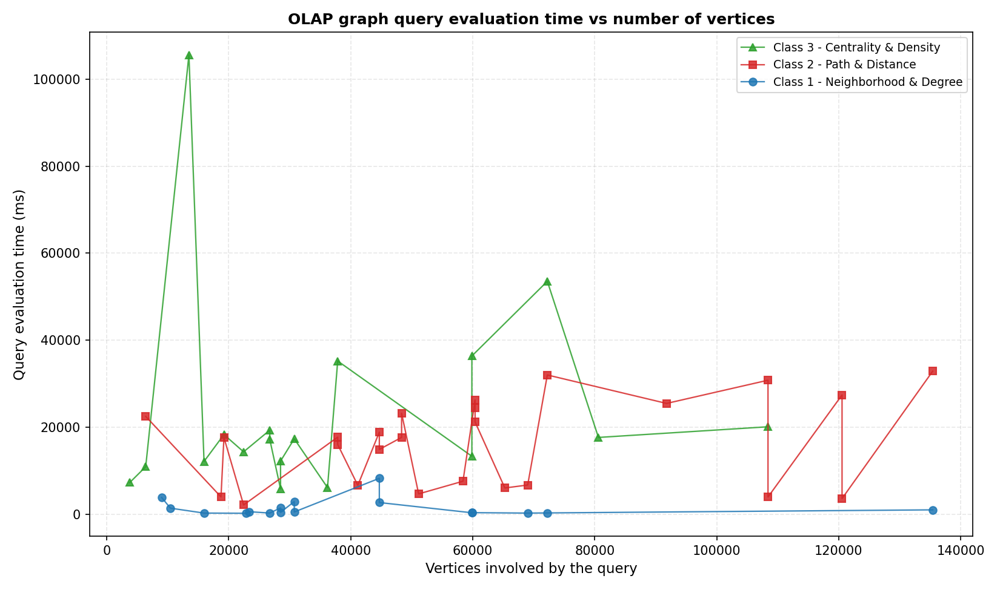

# Graph OLAP on Spark

OLAP over a graph instead of a table. The graph is 330,317 users and products from Amazon reviews. Dicing a
"cuboid" means taking a slice of the graph, and roll-up means aggregating over it. On top of that, nine
analytical queries in three classes, running on **Apache Spark + GraphFrames** with **Hadoop HDFS** and the
**Memgraph** graph database, plus a 60-run experiment on what actually makes graph queries expensive.

Built by Abdelmoumen Deghbouche as a research exercise for the iDEA Lab (Big Data Engineering & Analytics),
University of Calabria.



## The finding

**What makes a graph query expensive is how many passes it makes over the graph, not how big the graph is.**

Over 60 randomised runs (fixed seed, cuboids from 3,764 to 135,420 vertices):

| | Result |
|---|---|
| Inside one algorithm (shortest paths, n = 9) | runtime tracks graph size, **r = 0.964** |
| All three query classes pooled (n = 60) | correlation collapses to **r = 0.098** |
| Single-pass neighbourhood queries | median **486 ms** |
| Multi-pass path and centrality queries | median **17,610 ms**, which is **36× slower** |

So slicing the graph smaller is not a performance strategy by itself. A 10× smaller slice buys almost nothing
for an iterative query, while rewriting a query as a single pass buys 36×. One caveat: 568k edges is small
for Spark, and its fixed per-stage cost keeps the curves flat. One centrality run near 105 s is an outlier
I have not explained.

Raw data: [`results/experiment.csv`](results/experiment.csv). Plots: [`results/plots/`](results/plots).

## Architecture

```
finefoods.txt.gz ──parse──> vertices.csv + edges.csv ──> HDFS
                                                          │
                     Spark + GraphFrames  <── GraphReader ┤ (fromCsv / fromMemgraph)
                             │                            │
                     OlapCuboid (dice)                Memgraph  <── GraphLoader (Bolt)
                             │
                 9 queries (roll-up happens here)
```

Storage sits behind one interface (`GraphReader`), so every query runs unchanged whether the graph is read
from HDFS or from Memgraph.

## The OLAP model

- **Dicing = selection.** `OlapCuboid` builds a slice of the graph: `all` (the apex cuboid, no filter),
  `byScore`, `byHelpfulness`, `byTimeWindow`, `byProductPopularity`, `sample`.
- **Roll-up = aggregation**, done inside the queries: per product, per hop distance, per k-core level, and
  per vertex type.

## The nine queries

| Class | Query | In one line |
|---|---|---|
| Neighbourhood | `multiHopDegreeDistribution` | How many products a user reviewed, then how many other users reviewed those same products: a roll-up along the distance dimension |
| | `egoNetworkAggregation` | Take the biggest hubs, and aggregate rating and density inside the neighbourhood around each one |
| | `ratingSummary` | Per product: number of reviews, average rating, spread |
| Path | `shortestPathMetrics` | Breadth-first search from the biggest hubs, then a histogram of how far everything else sits from them |
| | `reachabilityCounts` | From a seed, how much of the graph opens up after one, two and three hops |
| | `pathLengthDistribution` | How far apart the busiest users and the busiest products are, as a distribution |
| Centrality | `localClusteringCoefficient` | Are my neighbours also connected to each other? On this graph the answer is exactly zero |
| | `kCoreDecomposition` | Keep deleting every vertex with fewer than k connections, and report what survives for each k |
| | `pageRankAggregation` | PageRank inside the slice, with the importance then split between users and products |

## What the structure of the data forces

Every edge goes User → Product, so the graph is **bipartite** and contains no odd cycle. Three results follow
from that alone:

- **No triangles, so the clustering coefficient is exactly 0.** The numerator is zero. It is not missing data.
- **Every ego network is a star**, so `n` vertices carry exactly `n − 1` edges, up to repeated reviews.
- **Every user-to-product distance is odd.**

## An engineering lesson: the driver crash

The iterative queries (k-core peeling, reachability frontiers) add a join on every round. Spark keeps the
whole logical plan, so the plan's **text** grows every iteration until the driver runs out of memory. The
data was never the problem; the description of the computation was.

- `cache()` does not fix it: it keeps the lineage, so the plan keeps growing.
- `localCheckpoint()` does: it materialises the result and truncates the lineage.

The settings that go with it, with the reasoning, are in [`conf/spark-defaults.conf`](conf/spark-defaults.conf).

## The data

[Amazon Fine Foods Reviews](https://snap.stanford.edu/data/web-FineFoods.html) from Stanford SNAP (568,454
reviews). It is not committed here; download `finefoods.txt.gz` from SNAP. One review becomes one edge:

```
vertices.csv   id,label,name                     330,317 vertices (256,059 users + 74,258 products)
edges.csv      src,dst,score,helpfulness,timestamp   568,454 edges
```

Ids are prefixed `u_` / `p_`, because raw Amazon user and product ids are indistinguishable strings.

## How to run

Requirements: Java 17, Maven, Spark 3.5.x, and optionally Hadoop HDFS and Memgraph.

```bash
# 1. build the graph from the raw SNAP file
python scripts/parse_finefoods.py finefoods.txt.gz vertices.csv edges.csv

# 2. build the jar
mvn -q package

# 3. (optional) load the graph into Memgraph
spark-submit --class com.idealab.grapholap.storage.GraphLoader \
  target/graph-olap.jar edges.csv bolt://localhost:7687

# 4. the 18 demo evaluations over four cuboids (from a CSV path, or "memgraph")
spark-submit --class com.idealab.grapholap.queries.DemoQueries \
  target/graph-olap.jar edges.csv

# 5. the 60-run performance experiment (fixed seed 42), then the plots
spark-submit --class com.idealab.grapholap.experiment.PerformanceExperiment \
  target/graph-olap.jar edges.csv 60 results/experiment.csv 42
python scripts/plot_results.py results/experiment.csv results/plots/
```

On Java 17, Spark needs the usual `--add-opens` driver options (`java.base/sun.nio.ch`, `java.nio`,
`java.lang`, `java.util`).

## Layout

```
src/main/java/com/idealab/grapholap/
  model/       OlapCuboid (dicing), QueryResult
  queries/     NeighborhoodQueries, PathQueries, CentralityQueries, DemoQueries
  storage/     GraphReader (HDFS / Memgraph), GraphLoader, MemgraphStorage
  experiment/  PerformanceExperiment
scripts/       parse_finefoods.py, plot_results.py
conf/          spark-defaults.conf
results/       experiment.csv, plots/
```
